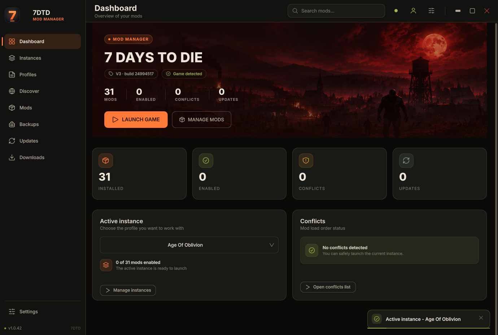
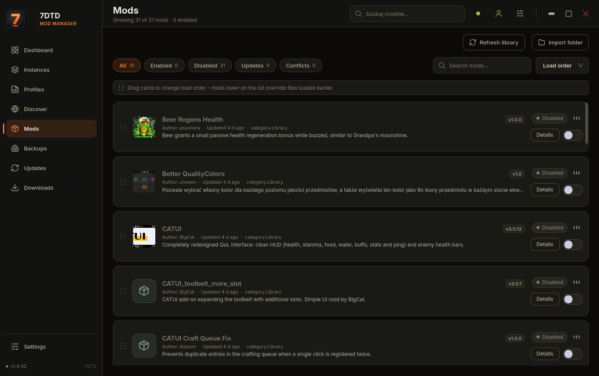
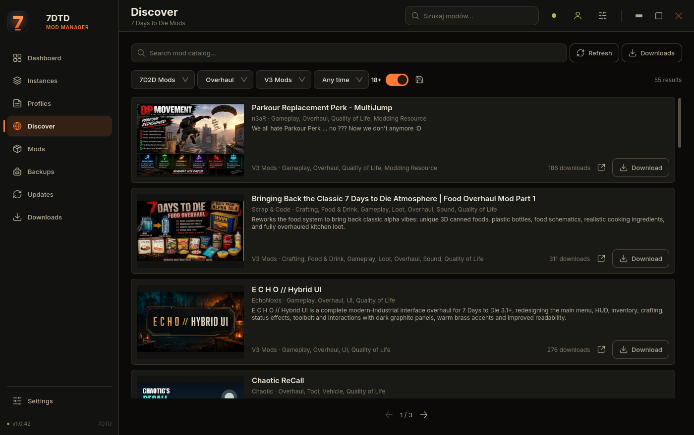
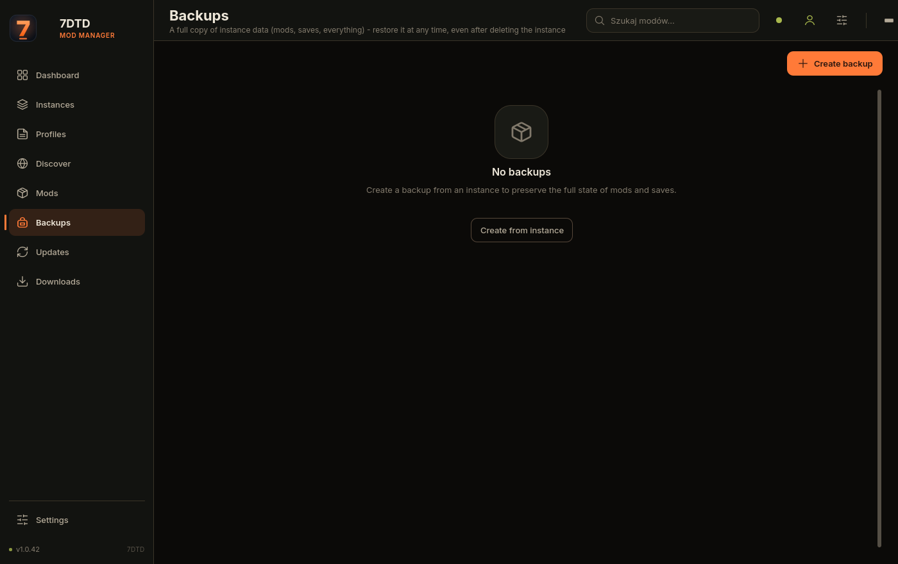
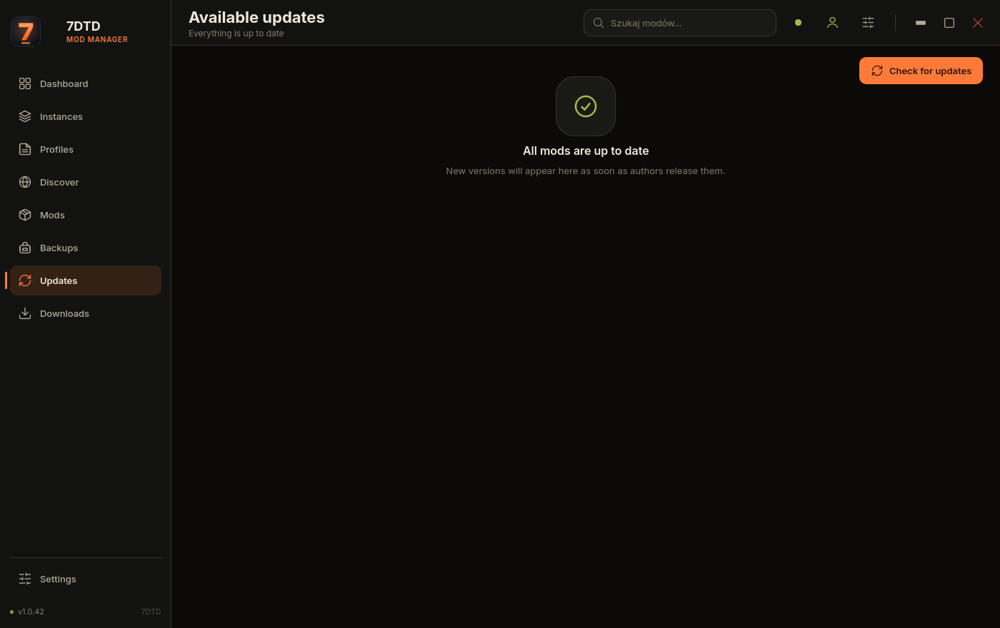
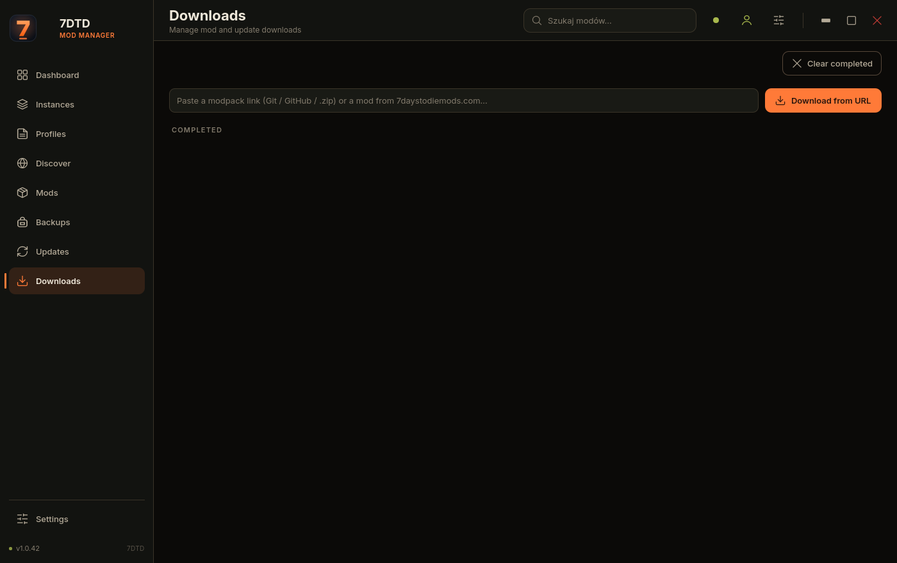
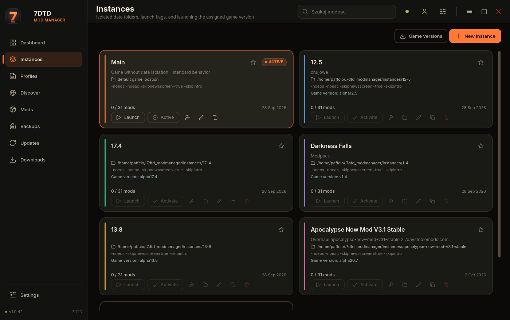
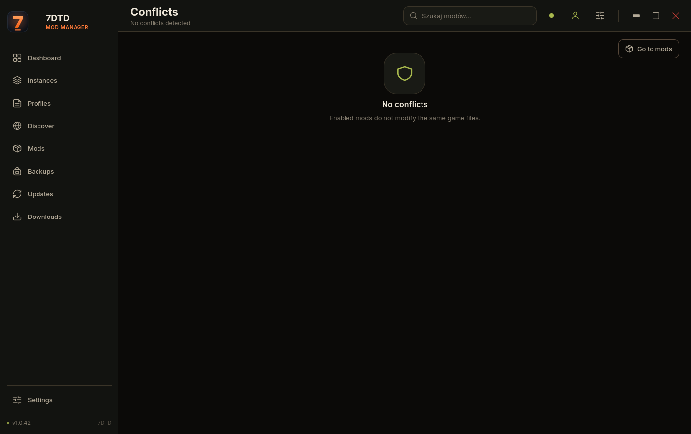
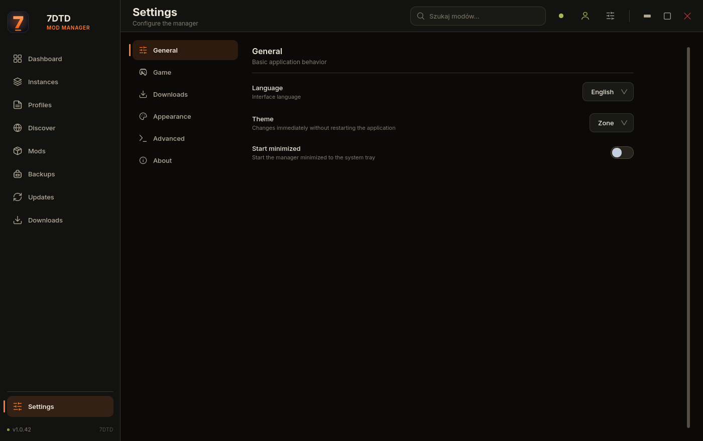
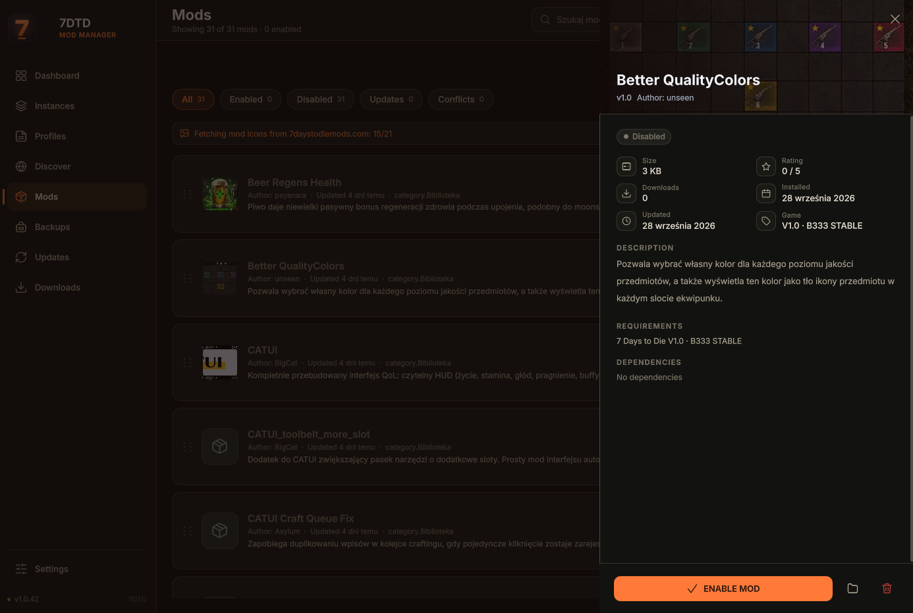

# 7DTD Mod Manager

A Linux desktop launcher and mod manager for **7 Days to Die**, built with **Python, PySide6, and QML**.

7DTD Mod Manager brings game-version control, isolated instances, mod installation, modpacks, overhauls, backups, downloads, updates, conflict detection, profiles, and online mod discovery into one desktop application.

**Author:** Paffcio
**Platform:** Linux
**Current version:** 1.0.42
**UI languages:** English and Polish
**Default language:** English on a new installation; Polish can be selected in Settings.

## Features

### Mod library

- Centralized local mod library with metadata, versions, source information, target game version, update state, and conflict information.
- Enable or disable mods without duplicating the whole library for each instance.
- Import mods from folders and rescan the configured Mods directory.
- Open mod folders, check for updates, update, search online, and uninstall mods.

### Isolated instances

- Create separate game instances with their own data directories and Mods folders.
- Assign a concrete downloaded game branch to each instance.
- Verify that the required branch is actually installed before launch.
- Modpack and overhaul installations carry their required game version into the created instance.
- Modpack/overhaul flows automatically use `-noeos` and `-noeac`.
- Favourite instances stay at the top of the list and are protected from deletion until the favourite flag is removed.
- Rename, duplicate, edit, activate, rebuild, open folders, and remove instances from one place.

### Game versions and Steam

- Download specific 7 Days to Die branches through DepotDownloader.
- Keep downloaded branches isolated under `~/.7dtd_modmanager/game-versions/`.
- Treat the normal Steam installation as a separate game source; a current Steam build is never assumed to be compatible with an older modded instance.
- Check the required downloaded branch before launching an instance or downloading a source that requires a particular branch.
- Handle stale DepotDownloader processes, retries, partial downloads, and large download progress safely.
- Support Steam Guard QR authorization and saved Steam session state.
- Show a compact Steam account menu in the header with re-login and logout actions.

### Modpacks and overhauls

- Install supported packages from Git repositories, GitHub releases, and direct ZIP URLs.
- Browse supported overhaul packages through Discover.
- Reuse cached archives when available.
- Distinguish actual installation state from historical completed download records.

### Discover

- Browse the online 7daystodiemods.com catalog.
- Filter by category, game version, time range, and adult-content visibility.
- Open detailed mod pages and download supported files directly from the launcher.
- Support GitHub-based overhaul sources where the source provides a supported archive.
- Show installation state based on real library/instance contents.

### Profiles

- Manage supported V3+ game profiles using the central `Presets/` layout.
- Assign profiles to instances or expose them globally.
- Keep profile handling separated from older game-version layouts where required.

### Backups

- Create full instance backups containing mods, saves, and instance data.
- Restore a backup even after the original instance has been removed.
- Create, refresh, restore, and delete backups from the dedicated page.
- Protect backup operations with data-path and running-game safety checks.

### Updates and downloads

- Check installed mods for newer versions.
- Queue downloads and mod updates in a shared download manager.
- Pause, cancel, retry, and clean supported downloads.
- Reuse cached archives and resume compatible HTTP transfers.
- Display sizes in readable `KB/MB/GB` units.
- Clamp progress and ETA values to safe ranges.
- Keep download byte counters separate from archive extraction/file-count progress.

### Global search

The header search can query installed mods, instances, and Discover results. Suggestions are displayed below the search box and close when navigating away, pressing `Esc`, or clicking outside.

### Themes and localization

- Dark, Light, Stalker, and Stalker Light themes.
- Configurable UI scaling, animations, dashboard artwork rotation, and custom window-frame behaviour.
- Full English/Polish localization for pages, dialogs, buttons, tooltips, placeholders, statuses, notifications, and application-owned folder-picker text.
- The language can be switched without restarting the launcher.

## Screenshots

The repository includes English UI screenshots captured from the current application. They are kept in `docs/screenshots/` so the README stays self-contained.

<table>
<tr>
<td align="center"><br><sub>Dashboard</sub></td>
<td align="center"><br><sub>Mod library</sub></td>
</tr>
<tr>
<td align="center"><br><sub>Discover</sub></td>
<td align="center"><br><sub>Backups</sub></td>
</tr>
<tr>
<td align="center"><br><sub>Updates</sub></td>
<td align="center"><br><sub>Downloads</sub></td>
</tr>
<tr>
<td align="center"><br><sub>Profiles</sub></td>
<td align="center"><br><sub>Conflicts</sub></td>
</tr>
<tr>
<td align="center"><br><sub>Settings</sub></td>
<td align="center"><br><sub>Mod details drawer</sub></td>
</tr>
</table>

The supplied archive also contains `docs/screenshots/modpacks-en.png`; the clearer `backups-en.png` filename is used above for the Backups screen.

## Requirements

### Runtime

- **Python 3.12** for source development and the current packaging layout.
- **PySide6 >= 6.6, < 7.0**
- **requests**
- **Pillow**

The project uses a local `.venv`, so a global PySide6 installation is not required.

Additional tools are only needed for specific workflows:

- **Steam** for authenticated depot downloads.
- **Proton** for launching downloaded Windows game branches.
- **Git** only for modpack sources that are Git repositories. It is not required by the launcher UI itself.

### Build dependencies

`build.sh` requires: `rsync`, `dpkg-deb`, `curl`, and `python3`. `appimagetool` is downloaded automatically into `.build/` when necessary.

## Get the project from GitHub

The source repository can be downloaded without using Git for project versioning:

1. Open the Paffcio GitHub repository page.
2. Select **Code**.
3. Select **Download ZIP**.
4. Extract the archive and enter the project directory.

Author profile: https://github.com/paffciostudio

The permanent repository URL is not hard-coded here because the project repository path may change before publication.

## Run from source

From the project root:

```bash
./venv.sh
./run.sh
```

`./venv.sh` creates or reuses `.venv` and installs the dependencies from `requirements.txt`.

Run the full automated suite with:

```bash
./test.sh
```

`test.sh` runs pytest from the local virtual environment.

## Build packages

Build both Debian and AppImage packages with:

```bash
./build.sh
```

The script cleans `dist/` and the temporary build tree, assembles the application payload, bundles the Python environment, builds a `.deb`, builds an AppImage, and prints the output paths.

To build and install/update the Debian package in one step:

```bash
./build.sh --install
```

or:

```bash
./build.sh -i
```

Manual Debian installation:

```bash
sudo apt install ./dist/7dtd-mod-manager_<version>_<arch>.deb
```

## Game-version safety

A Steam installation is not a universal compatibility layer. If an instance or download source requires a concrete branch, the launcher checks whether that branch is actually downloaded under the local game-version store. Missing branches are reported before the risky operation is attempted.

This prevents an instance created for an older branch from silently launching against a different Steam build.

## Steam account and QR login

Steam authentication is optional until an authenticated depot operation needs it. The header account button exposes the current session state. A saved session opens a compact account menu with **Sign in again** and **Sign out**. A missing session opens the full QR authorization flow.

Logging out only clears the launcher's stored Steam session identity; it does not modify the Steam account itself.

## Application data

Application data is stored under:

```text
~/.7dtd_modmanager/
```

Common locations include:

| Path | Purpose |
| --- | --- |
| `library/`, `library.json` | Local mod library content and its metadata registry |
| `activation.json` | Global and per-instance activation state |
| `instances.json`, `instances/` | Instance registry and default instance data directories |
| `backups/`, `modpacks.json` | Backup folders (one per instance) and the backup registry; `modpacks.json` keeps its historical name |
| `mods/` | Default user Mods folder |
| `downloads/`, `downloads.json` | Downloaded archives and the download queue |
| `installed-archives.json` | Archives from `downloads/` already installed into the library |
| `settings.json` | Application settings |
| `profiles/`, `profiles.json`, `profile-state.json` | Central game profiles, active profile, and profile-to-instance assignments |
| `state.json` | Mod loader state |
| `game-versions/`, `game-versions.json` | Downloaded game branches and their registry |
| `tools/DepotDownloader` | Steam depot downloader tool |
| `steam-account.json` | Saved launcher Steam identity |
| `cache/` | Cached catalog responses, Steam branch list, and mod thumbnails |
| `logs/` | Application logs |

Older builds stored backups in `modpacks/`; the launcher migrates that folder to `backups/` on startup.

## Localization architecture

Translation resources are centralized in:

```text
qml/i18n/
├── I18n.qml
├── qmldir
└── translations.js
```

The Polish and English catalogs use matching keys. Launcher-owned UI text, dialogs, tooltips, placeholders, statuses, and notifications are resolved through the same localization layer.

The custom folder browser is localized by the application. When Qt opens a native operating-system file/folder dialog, the application localizes its own title and filters; the remaining native chrome (for example system navigation labels and standard buttons) is controlled by Qt and the desktop environment and follows the system locale.

## Project layout

```text
assets/                 Icons, fonts, artwork
docs/screenshots/       English UI screenshots used by this README
qml/                    QML UI, components, theme, localization
src/                    Python backend and services
tests/                  Automated tests
scripts/                Desktop integration helpers
tools/                  Development utilities
build.sh                Debian/AppImage packaging
run.sh                  Source launcher using .venv
venv.sh                 Development environment setup
test.sh                 Test-suite entry point
requirements.txt        Python dependencies
```

## Troubleshooting

### Launcher does not start

From the project root, run:

```bash
./run.sh
```

If `.venv` is missing, run:

```bash
./venv.sh
```

### A required game branch is missing

Open **Instances → Game Versions**, authenticate with Steam when required, and download the branch needed by the instance or mod source.

### Discover shows a package as downloaded even after deleting the instance

The launcher checks actual installed library/instance content instead of trusting a historical `completed` queue entry on its own.

### Download progress shows a strange value

Progress values are clamped to safe ranges, negative sizes are normalized, large values are displayed using human-readable units, and download bytes are kept separate from extraction/file-count progress.

## License

This project is licensed under the MIT License. See the [LICENSE](LICENSE) file for details.

## Author

**Paffcio**  
https://github.com/paffciostudio
